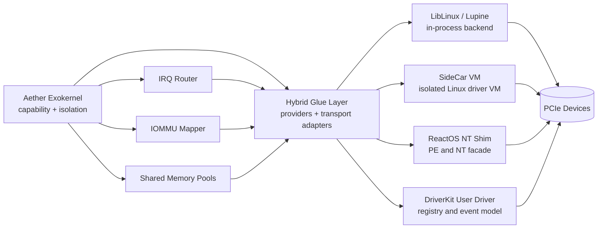

# Hybrid Driver Glue Layer

This document captures the implementation roadmap and protocol surface for the Aether kernel hybrid driver strategy.

## 1) Component Topology

## 2) Implementation Phases

1. Foundation
- Keep one provider trait and one resource model in kernel module space.
- Enforce capability-based MMIO, DMA, IRQ, and shared-memory grants.

2. Linux-first Track
- LibLinux syscall mapper and queue dispatcher.
- SideCar wire protocol and control/data queue split.
- Zero-copy path policies for network and block.

3. Windows Track
- PE parser with section/import/reloc parsing.
- NT symbol table and IRQL/spinlock abstractions.
- Native and Wine-host bridge execution policy selection.

4. DriverKit Track
- Registry class matching and lifecycle transitions.
- User-mode event queue pump with bounded budget.
- MMIO and IRQ grant mapping through user-mode context.

5. Runtime Hardening
- Cross-provider health signals.
- Backoff and failover routes.
- Per-provider telemetry and readiness gate checks.

## 3) Current Kernel Surface

The following modules currently back the hybrid architecture:

- `kernel/src/modules/drivers/hybrid.rs`
- `kernel/src/modules/drivers/hybrid/linux.rs`
- `kernel/src/modules/drivers/hybrid/sidecar.rs`
- `kernel/src/modules/drivers/hybrid/liblinux.rs`
- `kernel/src/modules/drivers/hybrid/reactos.rs`
- `kernel/src/modules/drivers/hybrid/driverkit.rs`
- `kernel/src/modules/drivers/hybrid/orchestrator.rs`

### Implemented Runtime Helpers

- SideCar wire header encoder/decoder plus payload body codec.
- LibLinux syscall queue and bounded batch dispatcher.
- ReactOS PE import descriptor binding and relocation patch planning.
- DriverKit binding lifecycle with fault/quarantine/recovery policies.
- Hybrid orchestrator to select backend plans from one request model.

## 4) Shared Memory vs IPC Cost Model

| Path | Data Plane Default | Control Plane Default | Relative Cost Notes |
|---|---|---|---|
| SideCar VM | Shared rings + granted DMA windows | VirtIO command queues | VM transitions dominate control; data path remains low-overhead after setup |
| LibLinux | In-process zero-copy SG | Direct function call dispatch | Lowest transition overhead; copy only when policy requires isolation |
| ReactOS | MDL-like pinned page grants | NT-style request/completion messages | Compatibility layer adds control overhead; data path can still stay grant-based |
| DriverKit | User-mode shared memory windows | Event queue IPC | Predictable message overhead with strong isolation and crash containment |

## 5) Safety Constraints

- Unsafe usage must remain concentrated in MMIO, DMA map/unmap, and binary parser boundaries.
- Provider modules must not bypass capability checks.
- Queue pumps must be budget-bounded to avoid starvation.
- Resource revocation must remain possible at runtime.

## 6) Near-term Execution Plan

1. Attach LibLinux syscall dispatcher to linux_shim entry points with feature-gated adapters.
2. Connect SideCar payload codec directly to control queue transport edges.
3. Replace ReactOS fallback import selection with DLL/name-aware thunk parser.
4. Extend DriverKit recovery with backoff windows and health metrics integration.
5. Add focused tests for each backend under the existing `drivers` feature matrix.
