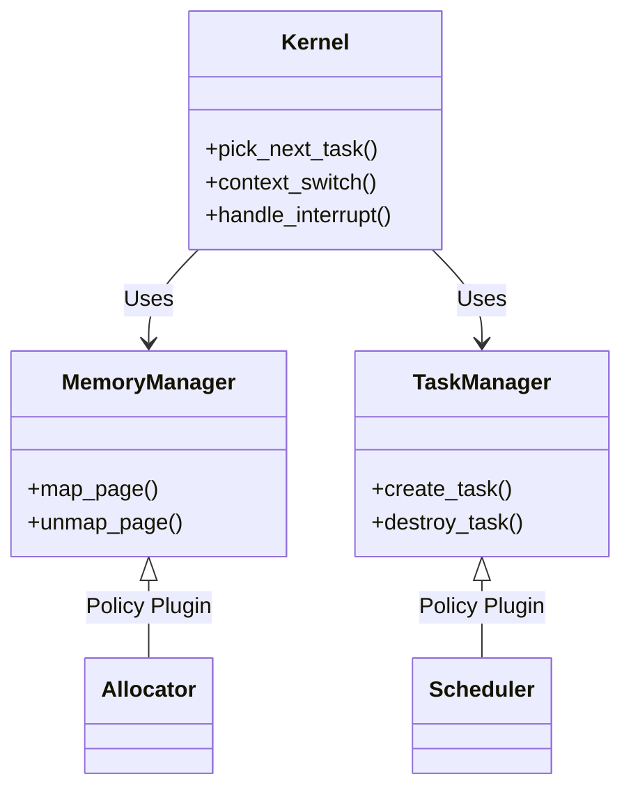

# Exokernel Core Architecture (The Brain)

[](.)
[](.)

The **Exokernel Core** (`kernel/`) is the minimal set of mechanisms required to safely multiplex hardware resources. It strictly adheres to the **Mechanism, Not Policy** philosophy, delegating resource allocation decisions to pluggable modules or user-space libraries.

---

## 🚦 Status & Audit (Feb 2026)

- **SMP, per-CPU data, RCU, IrqSafeMutex:** Complete and tested
- **Scheduler, memory, dispatcher, VFS bridges:** Complete, modular, and feature-gated
- **All critical audit findings resolved:**
    - User pointer validation, buffer helpers, negative-path tests, policy enums, deadlock detection
- **Telemetry:** All major subsystems export runtime stats
- **Remaining:**
    - Continue stress and negative-path testing
    - Expand formal verification and audit automation

---

## 🏗️ Architecture

The Core is designed to be **Configurable** via `hyper_config.toml` and **Extensible** via traits.



### 🧠 Core Components

1.  **Task Management (`task.rs`)**:
    *   **Structure:** `Task` struct holding execution context (registers, stack).
    *   **Function:** Doesn't define *how* tasks are switched, only *what* a task is.
    *   **Interface:** Provides standard methods for modules to manipulate task state.

2.  **Memory Management (`memory.rs`)**:
    *   **Orchestrator:** `MemoryManager` coordinates virtual address space layout.
    *   **Delegation:** Physical frame allocation is delegated to `modules/allocators/`.

3.  **Synchronization (`rcu.rs`, `cpu_local.rs`)**:
    *   **RCU (Read-Copy-Update):** High-performance synchronization for read-heavy workloads (task lists, file tables).
    *   **Per-CPU Data:** Scalable data structures to avoid global lock contention.

---

## 🔄 The Kernel Loop (Simplified)

The main kernel loop in `src/main.rs` is intentionally minimal:

```rust
#[no_mangle]
pub extern "C" fn kmain() -> ! {
    loop {
        // 1. Ask the Scheduler (Policy) for the next task to run
        if let Some(task_id) = scheduler.pick_next() {
            // 2. Perform the Context Switch (Mechanism)
            context_switch(current_task, next_task);
        } else {
            // 3. Halt the CPU to save power until an interrupt occurs
            hal::halt();
        }
    }
}
```

This ensures maximum flexibility. If you want a **Unikernel**, the scheduler simply returns the single running task forever (zero overhead). If you want a **Multi-User System**, the scheduler implements complex logic (CFS, MLFQ).

---

## 🚧 Roadmap

### Phase 1: Robustness (Q2 2026)
- [x] **Symmetric Multi-Processing (SMP):** Multi-core booting and task distribution hooks are active.
- [x] **Dynamic Module Loading:** Runtime ELF module loading path is integrated (`xmas-elf` validation + PT_LOAD planning + process-image orchestration + materialization + paging apply + segment copy/zero-fill + loader telemetry + preflight fingerprint validation + launch/handoff/execute-ready bridge).
- [x] **Panic Handling:** fatal path with kernel dump and policy-driven halt/spin behavior.

### Phase 2: User-Space Support
- [x] **Syscall Wrapper:** `syscall` / `sysret` instruction wrapper for clean API boundaries.
- [x] **Syscall Control-Plane Extensions:** Launch telemetry + process lifecycle introspection syscalls integrated (`launch_stats`, `process_count`, `process_list_ids`, `process_spawn`, `process_image_state`, `process_mapping_state`, `process_terminate`, `process_launch_context`, `process_claim_context`, `process_ack_context`, `process_context_stage`, `process_consume_ready_context`, `task_terminate`, `task_process_id`) with VFS/network/power lifecycle control bridges, including network backpressure-policy and alert-threshold/report control-plane syscalls.
- [x] **Process Abstraction:** Grouping `KernelTask` instances with shared address space (CR3) and capabilities. (module image binding + applied virtual mapping metadata + unified process/bootstrap-task construction APIs + runtime process registry introspection APIs integrated)
- [x] **Thread-Local Storage (TLS):** Userspace `fs`/`gs` base save/restore and syscalls are wired.

### Phase 3: Advanced Features
- [x] **Power Management:** ACPI C-states and P-states (dynamic frequency scaling) integrated with control-plane authorization, ACPI-aware override guards, runqueue saturation clamps, and fail-safe telemetry.
- [x] **Real-Time Preemption:** Deadline-oriented runtime guard now includes starvation-aware forced-reschedule, EDF pressure feedback, burst-based deadline alerting/escalation, override knobs, and expanded telemetry.
- [x] **VFS Mount Control-Plane:** Kernel mount registry (`kernel::vfs_control`) + mount/list/path + unmount syscalls + runtime telemetry integrated.
- [x] **Network Runtime Control-Plane:** Runtime poll enable/disable + forced poll/reset controls + telemetry + userspace syscall bridge integrated.

---

## 🛠️ Configuration

The Core is heavily influenced by `hyper_config.toml`:

```toml
[kernel]
preemption = true       # Enable/Disable preemption
time_slice_ns = 2000000 # Time slice for Round Robin
max_cpus = 64           # Maximum supported CPUs
```

---

## 🔎 Independent Audit Findings (2026-02-19)

### Critical

- **Userspace boundary hardening gap:** syscall paths consume userspace buffers without full copyin/copyout + mapped-page verification model.
- **Yield semantic bug fixed:** `sys_yield` previously spin-looped and could delay fairness; now it requests forced reschedule through RT preemption guard.

### High

- **Kernel idle and fatal paths still rely on spin/halt policy strings**; robust deployment should favor explicit typed policy enums and static validation.
- **Scheduler-triggered context switch path is timer-centric**; cooperative user-triggered reschedule remains limited without direct immediate dispatch primitive.

### Performance

- **Lock+interrupt discipline is correct conceptually**, but global/shared locks in hot paths can still become bottlenecks under high core counts.

### Audit Remediation Progress

- [x] `sys_yield` now feeds scheduler fairness via forced-reschedule request (instead of passive spin).
- [x] Kernel panic/idle policy parsing refactored to typed enums for clearer maintenance.
- [x] Syscall user-buffer access paths centralized through helper wrappers to reduce unsafe duplication.
- [x] Mapping-aware user buffer validation integrated (`PRESENT + USER + WRITABLE` checks via page-table walk) for helper-backed paths.
- [x] Added dedicated negative-path tests for syscall helper validation (cross-page traversal + permission-failure rejection).
- [x] `usize`-slice syscall write helpers now reject unaligned user pointers before raw slice construction and expose dedicated telemetry (`user_word_unaligned_denied`).
- [x] Spawn priority input now has explicit bounds validation (no silent narrowing cast).
- [x] VFS mount/unmount path syscall handlers now share bounded path-read helper + mount-record serialization helper to reduce duplication.
- [x] Watchdog now exposes runtime telemetry (`tick/checks/stalls/last_stalled_cpu/hard_panic_ticks/hard_panics`) for production diagnostics.
- [x] Dispatcher layer now includes baseline IRQ-storm throttling with runtime throttle/window-reset counters.
- [x] Extended coverage from helper-level tests to runtime-style mapped/unmapped-page integration stress scenarios (cross-page gap rejection, sparse mapping traversal, and write-permission matrix checks).

### Deep Audit Critical Fixes (2026-02-21)

- [x] **C1: Scheduler lock held across `context_switch()` — guaranteed deadlock.** Lock is now released before switching; all task metadata extracted inside critical section, switch performed outside.
- [x] **C4: RCU use-after-free race condition.** Added atomic reader counter; `RcuGuard` now tracks read-side critical sections to prevent writers from reclaiming data while readers are active.
- [x] **H1: `IrqSafeMutex` silent infinite-spin deadlock.** Added bounded spin detection (panic after 10M iterations) and `try_lock()` non-blocking method.
- [x] **C5: Unified Task Structure.** Eliminated the redundant `Task` (internal) and `KernelTask` (interface) duplication. All components now use a single architecture-aware `KernelTask` definition.
- [x] **C6: Type-Safe Identification.** Replaced raw `usize` aliases for `TaskId` and `ProcessId` with type-safe wrappers across the entire kernel, scheduler, and syscall layers to prevent ID-confusion bugs.
- [x] **C7: Scheduler Data Loss.** Fixed a severe bug where FIFO, MLFQ, and other schedulers were discarding `KernelTask` data, making context switches impossible. They now properly store the task metadata required for context switching.
- [x] **C8: Adaptive Slab Allocator.** Added high-water mark limits (64 blocks) to per-CPU caches. Excess memory is now automatically returned to the global pool, preventing memory hoarding.
- [x] **C9: Hardened Upcall Dispatcher.** Migrated to type-safe `ProcessId` and added queue bounds (128 pending) to prevent asynchronous delivery storms from exhausting memory.
- [x] **C10: Dynamic Heap Discovery.** Removed hardcoded memory addresses; the kernel now dynamically identifies usable RAM regions via the bootloader memory map, improving boot stability.


### Core-Library Boundary Integration Track (2026 H1)

- [x] Core runtime loop now supports library-first networking path (LibNet fast-path capable) while preserving fallback bridge polling semantics.
- [x] Network control-plane operations are routed through facade APIs (`network::bridge`) to reduce direct coupling to monolithic internals.
- [x] Add policy-aware core scheduler hooks for library service classes (interactive/throughput/background).
- [x] Export bounded core pressure signals (queue depth/interrupt pressure) as first-class inputs for library policy engines.
- [x] Driver dataplane baseline is integrated into runtime/IRQ loop (`net_core` queue bridge for active VirtIO/E1000 path with normalized counters).

### Execution Board (2026)

#### Phase A: Core Contract Clarity
- [x] Boundary policy and library surface visibility integrated.
- [x] Network control-plane surfaced through facade boundaries.
- [x] Formalize core pressure signal schema consumed by library policy layers.

#### Phase B: Runtime Extraction
- [ ] Continue splitting monolithic runtime internals by subsystem domains.
- [x] Add subsystem-level startup dependency graph with strict ordering diagnostics.
- [ ] Add panic-scope isolation guards for non-critical service failures.

#### Phase C: Service-Class Scheduling
- [x] Integrate scheduler class hints from library service templates.
- [x] Add control-plane policy presets for interactive/server/realtime workloads.
- [x] Add runtime policy drift report for long-running mixed workloads.
- [x] Add driver wait-timeout delta signal into runtime policy drift decisions.
- [x] Add runtime policy drift reapply cooldown guard to prevent feedback flapping.

### Delivery Waves (Kernel Track)

#### Wave K1: Runtime Clarity
- [ ] Finalize subsystem runtime extraction boundaries.
- [x] Add startup dependency diagnostics with deterministic ordering output.

#### Wave K2: Pressure Contracts
- [x] Publish stable core pressure signal schema.
- [x] Wire pressure signals into library policy interfaces.

#### Wave K3: Service-Class Scheduling
- [x] Introduce service-class aware scheduler hints.
- [ ] Validate hint behavior with runtime telemetry assertions.

### Acceptance Criteria (Kernel)
- No policy logic leaks into mechanism-only core paths.
- Every new control-plane path includes telemetry and validation tests.
- Runtime behavior is deterministic under disabled feature flags.

---

## Kernel Risk & Limits Analysis (2026-02-20)

### 1) Mechanism/Policy Boundary Pressure
- **Status:** Boundary discipline is significantly improved with typed controls and feature gating.
- **Limit:** New service-class controls can still drift toward policy leakage if not routed through clear interfaces.
- **Risk:** Maintenance complexity and non-deterministic behavior under mixed feature combinations.
- **Control:** Keep policy parsing/types in control-plane facades, preserve mechanism-only kernel execution paths.

### 2) Scheduler Pressure Signal Contract
- **Status:** Versioned core pressure snapshot schema is now published and consumed by LibNet service preset selection.
- **Limit:** Initial schema focuses on scheduler/watchdog/net-queue pressure and should evolve with explicit backward-compatible version bumps.
- **Risk:** Aggressive threshold tuning can still misclassify edge workloads without scenario-specific calibration.
- **Control:** Keep schema versioning strict and validate preset mapping behavior with regression tests.

### 3) Runtime Extraction Completeness
- **Status:** Extraction is progressing subsystem-by-subsystem (notably in networking runtime paths).
- **Limit:** Remaining monolithic internal blocks still increase coupling and review surface.
- **Risk:** Slower incident isolation and harder root-cause attribution.
- **Control:** Continue physical split by domain with strict startup dependency diagnostics and telemetry parity checks.
