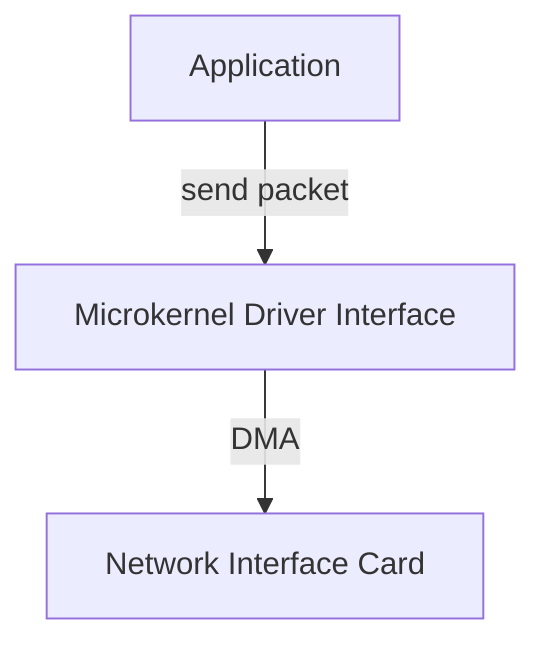

# AetherCore Networking Stack

The **Networking Subsystem** allows applications to communicate over Ethernet or Wi-Fi. True to the **Exokernel** philosophy, the "Stack" (TCP/IP logic) is separate from the "Card" (NIC Driver).

---

## 🚦 Status & Audit (Feb 2026)

- **VirtIO-Net and E1000 drivers:** Init/control path and RX/TX dataplane baseline complete; advanced feature-depth work continues.
- **smoltcp integration:** Complete, feature-gated
- **eBPF, WireGuard, HTTP/HTTPS:** Baseline support, feature-gated
- **Telemetry:** Adaptive polling, drop counters, queue depth, and forced-poll telemetry integrated
- **Critical:** Real NIC dataplane maturity is limited; production networking not yet available
- **High:** End-to-end hardware-backed throughput/latency guarantees not yet established
- **Performance:** Polling architecture is efficient but needs more adaptive pacing/backpressure

### Next Steps
- [x] Complete VirtIO/E1000 RX/TX dataplane baseline
- [x] Add more negative-path and stress tests for network stack
- [x] Expand driver lifecycle trait coverage

---

## 🏗️ Architecture

A specialized, high-performance web server can bypass the entire kernel stack and talk directly to the NIC via **userspace drivers** (DPDK-style). For standard applications, we provide a shared stack based on `smoltcp`.

### 🚀 Key Features

*   **Zero-Copy Networking:** Packets are never copied from kernel space to user space. We simply swap ownership of the buffer page.
*   **Userspace Drivers / Library OS Protocols:** Keep Core focused on transport/runtime; higher-layer protocols (HTTP, etc.) are optional library-layer features.
*   **Async/Await:** Fully non-blocking socket operations.

### Current Module Map

*   **`network::bridge`**: smoltcp runtime bridge lifecycle (`init/reinit/poll/force-poll/ingest`) + runtime poll controls.
*   **`network::transport`**: UDP/TCP/DNS/filter facade, plus transport snapshots and batch send/recv helpers.
*   **`network::http`**: static HTTP asset/sendifile request facade.
*   **`network::https`**: optional TLS terminate/config hooks (`rustls`-backed).
*   **`network::mod`**: compatibility root and shared state; runtime internals are being incrementally extracted.

---

## 🚧 Roadmap

### Phase 1: Basic Support (Q3 2026)
- [x] **VirtIO-Net Driver:** Support for QEMU networking. (legacy PCI probe + reset/feature negotiation + runtime init/IRQ hook + RX/TX virtqueue + control queue baseline integrated; advanced offload feature depth remains incremental)
- [x] **E1000 Driver:** Intel Gigabit Ethernet support (common in VMs). (Intel PCI probe + MMIO reset/init + runtime init/IRQ hook baseline integrated)
- [x] **smoltcp Integration:** Basic runtime bridge/control-plane baseline integrated (feature-gated `smoltcp` runtime manager + ethernet adapter + periodic poll loop + runtime poll control-plane + forced-poll/reset maintenance controls + init/poll/skip/health telemetry + syscall observability baseline).

### Phase 2: Transport Layer
- [x] **LibNet-Core (Optional):** Transport stack moved behind `network_transport` feature (UDP/TCP/DNS/filter surfaces compile only when explicitly enabled).

### Phase 3: Advanced Networking
- [x] **eBPF Filters:** Baseline in-kernel packet filter rule engine (protocol/port/len match + allow/drop actions) integrated into loopback/UDP/TCP send paths.
- [x] **WireGuard VPN (Library Optional):** Baseline tunnel control/data path behind `network_wireguard` feature (`wireguard_add_peer/remove/encapsulate/decapsulate`) with runtime telemetry.
- [x] **High-Performance HTTP (Library Optional):** Baseline static asset service with zero-copy `sendfile` view is now feature-gated (`network_http`) for library-layer usage, not Core baseline.
- [x] **HTTPS/TLS (Library Optional):** Optional `rustls`-backed TLS termination baseline integrated behind `network_https` (server-config install + TLS record termination API + telemetry; advanced handshake/cert policy remains incremental).

---

## 🔎 Independent Audit Findings (2026-02-19)

### Critical

- **Runtime stack is present but real NIC dataplane maturity is limited**; current behavior leans on loopback/runtime scaffolding and control-plane telemetry.

### High

- **Driver and stack readiness are asymmetric:** control APIs exist, but end-to-end hardware-backed throughput/latency guarantees are not yet established.
- **Reset/reinitialize control paths exist** and improve recoverability, but failure-domain isolation across tasks/processes remains an open design area.

### Performance

- **Polling architecture can be efficient**, but needs adaptive pacing/backpressure tuning to avoid CPU overuse in low-traffic and high-traffic extremes.

### Audit Remediation Progress

- [x] Runtime polling now supports adaptive pacing via configurable poll interval ticks.
- [x] Network runtime telemetry expanded with `force_polls`, `reinitialize_calls`, and `poll_interval_ticks` for clearer control-plane observability.
- [x] Loopback NIC path now enforces bounded queue backpressure with explicit drop telemetry.
- [x] Loopback bridge telemetry now tracks queue high-water depth and enforces bounded transmit queue behavior in smoltcp loopback device path.
- [x] Added driver-agnostic UDP datagram baseline with queue backpressure and transport telemetry (`udp_bind/send/drop/recv/high_water`).
- [x] Added driver-agnostic TCP/DNS transport baseline (`tcp_listen/connect/accept/send/recv` + `dns_register/resolve`) with bounded queues and runtime telemetry.
- [x] Added driver-agnostic packet filter baseline (`register/remove/clear` + match on protocol/ports/payload length) with runtime drop/allow telemetry.
- [x] Core-vs-Library split enforced in code: transport/filter APIs now build only under optional `network_transport` feature, keeping core networking minimal.
- [x] Added optional WireGuard baseline (`network_wireguard`) with peer lifecycle + tunnel encapsulation/decapsulation telemetry.
- [x] Moved high-performance HTTP static-path baseline behind optional `network_http` feature to keep Core networking focused on transport and packet processing primitives.
- [x] Added `network::bridge` facade module as first-step runtime split (`init/poll/ingest/control`) to decouple bridge runtime APIs from higher-layer transports.
- [x] Migrated external runtime callsites (kernel runtime, syscall control/stats, libnet snapshot) to `network::bridge` facade to reduce direct coupling to `network::mod` internals.
- [x] Added `network::transport` facade module to isolate UDP/TCP/DNS/filter APIs from bridge/runtime internals.
- [x] Added `network::http` facade module to isolate static HTTP/sendfile APIs from bridge/runtime internals.
- [x] Added centralized LibNet policy enforcement so L2/L3/L4/L6/L7 APIs respect Core-Library exposure and layer toggles.
- [x] Added LibNet runtime control profiles (low-latency/balanced/throughput/power-save), adaptive profile helper, and structured per-pump reports for bridge tuning.
- [x] Added transport throughput helpers (`udp_send_batch`, `tcp_send_batch`, `udp_recv_batch`, `tcp_recv_batch`) and transport snapshot API for faster library-side dataplane loops.
- [x] Added LibNet fast-path cycle helper (`PollStrategy + pump + snapshot`) so library services can run one-step adaptive networking loops with a single API call.
- [x] Added config-driven fast-path pump budget to control per-cycle L2 frame intake without changing code.

### Next Milestones (In Progress)

- [x] **Runtime internals split:** loopback smoltcp runtime state/device implementation is extracted into dedicated runtime file(s).
- [x] **Dataplane maturity path (baseline):** active driver dataplane manager now bridges core RX/TX queues with VirtIO/E1000 software-ring service paths and IRQ-driven servicing.
- [x] **Policy-driven backpressure:** queue-pressure response policies (`drop/defer/force-poll`) are exposed through runtime controls and telemetry.
- [x] **Service-level examples:** minimal TCP echo, UDP relay, HTTP static, HTTPS terminate examples are documented for LibNet API usage.
- [x] **Transport SLA telemetry:** percentile-style latency buckets (p50/p95/p99) are exposed for UDP/TCP send/recv operations, alongside queue saturation metrics.

### Execution Board (2026)

#### Phase A: Modular Extraction
- [x] Bridge facade extraction and external callsite migration.
- [x] Transport and HTTP facade extraction.
- [x] Runtime state physical extraction from `network::mod`.

#### Phase B: Dataplane Maturity
- [x] Real NIC RX/TX baseline integration for VirtIO/E1000 control surfaces (core queue bridge + IRQ/runtime service path).
- [x] Poll-loop mode matrix for low-latency vs throughput workloads (driver poll profile API + runtime profile selection baseline).
- [x] Backpressure policy selection integrated with runtime controls.

#### Phase C: Service Readiness
- [x] Library-level service template cycles exposed through LibNet.
- [x] End-to-end integration examples in tests (service-template UDP relay/TCP echo cycles + facade compatibility checks).
- [x] Operational SLO tables for queue depth, drop rates, and health score thresholds (driver SLO report + runtime breach logging baseline).

### Delivery Waves (Network Track)

#### Wave N1: Runtime Core Split
- [x] Move loopback/runtime state out of `network::mod`.
- [x] Keep facade API stable (`bridge/transport/http`).
- [x] Add compatibility tests for old entry points.

#### Wave N2: Dataplane Bring-Up
- [x] VirtIO-net RX/TX baseline through facade/control-plane paths.
- [x] E1000 RX/TX baseline through same control surfaces.
- [x] Driver dataplane telemetry normalization baseline (`active_driver`, queue depths, tx/rx bridge counters).

#### Wave N3: Throughput/Latency Quality
- [x] Percentile latency telemetry for UDP/TCP send/recv.
- [x] Queue pressure and saturation class metrics.
- [x] Profile-specific poll behavior validation matrix.

#### Wave N4: Operational Readiness
- [x] Runtime alert thresholds for health/drop/queue pressure with programmatic breach reports.
- [x] Deployment playbook: VM profile vs bare-metal profile.
- [x] Documented rollback/fallback strategy for network feature gates.

### Acceptance Criteria (Network)
- **API stability:** facade signatures remain backward compatible across waves.
- **Observability:** every new control or dataplane path exposes telemetry counters.
- **Safety:** policy-disabled paths return deterministic results and do not panic.
- **Verification:** `cargo check --tests` remains green after each wave.

---

## System Limits & Problem Analysis (2026-02-20)

### A) Dataplane Maturity Gap
- **Observation:** Control-plane/telemetry and driver dataplane baseline are now integrated beyond loopback-only runtime.
- **Limit:** Hardware descriptor-queue programming parity is still incomplete at advanced feature depth (VirtIO offloads/multiqueue and full E1000 descriptor lifecycle edge-cases remain incremental).
- **Impact:** Throughput/latency confidence is stronger in simulated/loopback paths than in full NIC-backed workloads.
- **Mitigation Path:** Prioritize VirtIO/E1000 RX/TX facade integration with shared telemetry schema.

### B) SLA Visibility Gap
- **Observation:** Counters/high-water metrics now include queue saturation classes and UDP/TCP send/recv percentile latency buckets.
- **Limit:** Percentiles are currently bucket-derived from runtime ticks; sub-tick precision and long-window distribution tuning are still incremental.
- **Impact:** Operators can quantify degradation trends (p50/p95/p99) with coarse-grained runtime precision.
- **Mitigation Path:** Evolve toward finer time sources and configurable histogram windows for high-fidelity SLO tuning.

### C) Operationalization Gap
- **Observation:** Policy and alert mechanics are present; end-to-end service examples and playbooks are still open.
- **Limit:** Runtime control features are powerful but less discoverable for deployment teams.
- **Impact:** Integration friction for new adopters and higher misconfiguration risk.
- **Mitigation Path:** Publish minimal TCP/UDP/HTTP/HTTPS service examples and rollout/rollback playbooks.

---

## Service-Level API Examples

The following minimal examples are intended as integration references for library-service loops.

### UDP Relay Cycle

- Bind relay socket with `libnet::udp_bind(local_port)`.
- Run one relay step with `libnet::run_udp_relay_cycle(&socket, upstream_port, max_packets)`.
- Use `run_udp_relay_cycle_with_preset(..., ServicePreset::ThroughputHeavy)` for high-load forwarding.

### TCP Echo Cycle

- Create listener via `libnet::tcp_listen(port)`.
- Run one service step with `libnet::run_tcp_echo_cycle(&listener, max_accepts, max_chunks_per_stream)`.
- Use `run_tcp_echo_cycle_with_preset(..., ServicePreset::LowLatency)` for interactive workloads.

### HTTP Static Cycle

- Register assets using `libnet::register_static_asset(path, content_type, body)`.
- Serve one request via `libnet::run_http_static_cycle(method, path, if_none_match)`.

### HTTPS Terminate Cycle

- Install TLS config via `libnet::install_tls_server_config(config)`.
- Terminate one record with `libnet::run_https_terminate_cycle(record, out)`.
- For policy-driven loops, use `_with_preset(..., ServicePreset::ControlHeavy)`.

---

## Deployment Playbook (VM vs Bare-Metal)

### VM Profile (QEMU/Cloud)

- Start from `PollProfile::Balanced`.
- Enable `network_transport` + `network_http` only if required by service layer.
- Keep runtime alert thresholds strict (`max_queue_high_water`, `max_drops`) and observe breach reports.

### Bare-Metal Profile

- Use `PollProfile::Throughput` for sustained throughput workloads.
- Increase L2 pump budget through LibNet fast-path config for NIC-heavy traffic.
- Validate dataplane counters (`active_driver`, RX/TX bridge counters, queue high-water) during soak runs.

## Rollback / Fallback Strategy

1. **Profile rollback:** switch from `Throughput`/`LowLatency` to `Balanced` (or `PowerSave` under low-load incident response).
2. **Policy rollback:** set backpressure policy to `Drop` for deterministic overload behavior.
3. **Feature rollback:** disable optional layers (`network_http`, `network_https`, `network_wireguard`) while keeping core networking active.
4. **Runtime fallback:** if LibNet is disabled, continue polling via `network::bridge::poll_smoltcp_runtime()` path.
5. **Recovery loop:** reinitialize runtime (`reinitialize_smoltcp_runtime`) and re-check alert report before re-enabling aggressive profiles.
