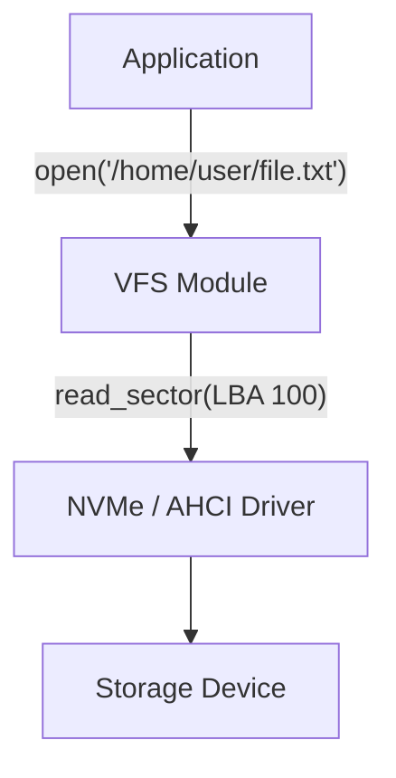

# AetherCore Virtual File System (VFS)

The **Virtual File System (VFS)** provides a unified interface for file storage, abstracting the details of physical devices (HDD, SSD, RAM Disk) and filesystems (FAT32, EXT4, NTFS).

---

## 🏗️ Architecture

Wait, this is an **Exokernel**. Why do we have a VFS?

The VFS in AetherCore is strictly an **optional library**. You can access the raw NVMe block device directly if you want maximum database performance. However, most applications want files and folders.

### 🚀 Key Features

*   **Pluggable Drivers:** Load support for new devices at runtime.
*   **Zero-Copy I/O:** `read()` directly into application buffers without kernel copies.
*   **Asynchronous I/O:** Based on `Future` and `async/await` for high concurrency.
*   **Library Adapter Matrix:** `DiskFsLibrary` + feature-gated backend probes (`fatfs`, `littlefs2-core`, ext4 hook, squashfs hook).
*   **Typed Backend Mode:** `DiskFsMode` + backend telemetry API for runtime library-side backend selection.
*   **Direct Library APIs:** `FatFsLibrary`, `LittleFsLibrary`, `Ext4Library` are exposed under `library_backends`.
*   **High-Level Disk API:** `DiskFsLibrary` now provides `exists`, `read_all`, `read_to_string`, `write_all`, `list_dir`, `metadata`, and `health_report`.

### Backend Adapter Matrix

| Backend | Feature | Status |
|---|---|---|
| RamFs | `vfs` | Active |
| FatFs (library) | `vfs_fatfs` | Probe + target-aware adapter API (real crate path on compatible targets) |
| LittleFs (library) | `vfs_littlefs` | Probe + adapter surface active (`littlefs2-core`) |
| Ext4 (library) | `vfs_ext4` | Probe + `load_from_bytes/read/read_to_string/exists/list_dir/metadata` active |
| SquashFS (library hook) | `vfs_squashfs` | Adapter hook active |

> Note: Full feature parity for FatFs/LittleFS/Ext4 requires block-translation glue (and for LittleFS, flash-oriented wear-leveling/FTL semantics).

### Library Visibility (Clarified)

- `library_backends::library_backend_inventory()` now provides a single source of truth for active VFS library adapters.
- `kernel_runtime` logs each active backend as: `name`, `feature`, `target_support`, `maturity`.
- This makes “which Library OS filesystem libraries are actually active in this build?” observable at runtime.
- Operational fallback/degraded-mode runbook is documented in `docs/vfs_backend_operational_playbook.md`.

---

## 🚧 Roadmap

### Phase 1: Basic Support (Q3 2026)
- [x] **RAM Disk (Initrd):** Loading initial filesystem from memory. (path-validated `RamFs` baseline + kernel mount control-plane + mount/list/path/unmount/stats syscalls + initrd entry loader API + initrd load telemetry integrated)
- [x] **Disk/File Library Baseline:** Initial `DiskFsLibrary` mounted-file API is available (`mount_ramfs_at`, `attach_existing`, `open`, `create`, `remove`, `unmount`) via kernel VFS mount control bridge.
- [x] **FAT32 Driver:** Read-only support for UEFI boot partitions. (`vfs_fatfs` adapter integrated; target-specific crate path requires compatible non-`target_os = none` profile)
- [x] **AHCI (SATA) Driver:** Basic disk read/write. (PCI probe + init + block read/write baseline in `modules/drivers/ahci.rs`)

### Phase 2: Advanced Storage
- [x] **NVMe Driver:** High-performance SSD support (Queues, MSI-X). (PCI probe + init + block read/write baseline integrated; advanced queue/MSI-X tuning remains incremental)
- [x] **EXT2/EXT4 Driver:** Standard Linux filesystem support. (feature-gated `vfs_ext4` read-only adapter via `ext4-view` with `read/read_to_string/list_dir/metadata`)
- [x] **VirtIO-blk:** Fast storage for virtual machines. (legacy/modern VirtIO block probe + init + block read/write baseline integrated)

### Phase 3: Network Filesystems
- [x] **NFS Client:** Access files over the network. (baseline library adapter surface integrated: `nfs_mount`/`nfs_read` + telemetry)
- [x] **9P Protocol:** VirtFS for QEMU host file sharing. (baseline library adapter surface integrated: `p9_attach`/`p9_read` + telemetry)

---

## 🔎 Independent Audit Findings (2026-02-19)

### Critical

- **VFS backend matrix is functionally heterogeneous:** RamFs/core controls are usable, while disk-backed adapters still require deeper block translation and integration maturity.

### High

- **Path validation is intentionally strict but simplistic** (`starts_with('/')`, `..`, NUL); canonicalization and mount namespace semantics should be formalized for multi-tenant robustness.
- **Library backend APIs are useful for feature gating**, but parity guarantees between backends are not yet uniform.

### Performance

- **Current in-memory paths are efficient for baseline testing**, while storage performance claims depend on yet-to-complete AHCI/NVMe full datapath and interrupt model evolution.

### Audit Remediation Progress

- [x] `DiskFsLibrary` path handling now uses centralized validation for mount/open/create/remove/read/write/list/metadata flows.
- [x] Backend inventory surface (`backend_inventory`) now provides explicit Ram/Fat/Little/Ext4/Squash enable-state descriptors.
- [x] Kernel mount control now canonicalizes mount paths (`//`, `.`, root normalization) and enforces normalized path identity for mount/unmount lookup safety.
- [x] RamFs initrd loader bridge now supports batch preloading (`load_initrd_entries` / `DiskFsLibrary::load_initrd`) with file/byte/failure telemetry.

### Execution Board (2026)

#### Phase A: Backend Contract Stabilization
- [x] Unified backend inventory and runtime visibility.
- [x] Path validation/canonicalization hardening.
- [x] Backend parity matrix tests for common high-level operations.

#### Phase B: Dataplane Integration
- [x] Tighten NVMe/AHCI data path integration with VFS latency telemetry.
- [x] Add buffered/unbuffered I/O policy toggles for library consumers.
- [x] Add mount-level health SLO thresholds and policy actions.

#### Phase C: Network Filesystem Productization
- [x] Elevate NFS/9P baseline into resilient reconnect-aware clients.
- [x] Add capability-aware namespace isolation for multi-tenant mounts.
- [x] Add operational playbooks for backend fallback and degraded modes.
